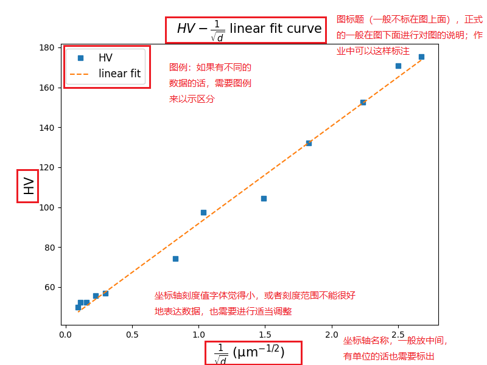
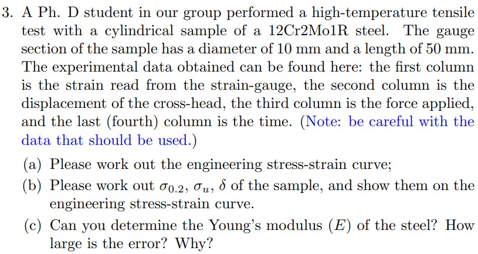

# 《材料力学行为》课程作业批改中看到的一些问题

- 作者：小小角色、走楼梯啊
- 创建时间：2022.11.07
- 不定期更新

---

## **注意事项**

- **提交电子版作业统一整合成 pdf 文档格式，很不建议提交图片。**
- **统一在作业中标注姓名学号等信息，方便助教批阅时识别。（重要！！！重要！！！重要！！！）**
- **不用手抄题目，写电子版的同学直接把题目贴过来或简要描述题目内容即可，节省一些不必要的时间。**
- **写电子版的同学建议写成竖版，方便批阅。**
- **部分同学电子版作业的字号偏小，建议适当调大一些。**
- **涉及到绘图的题目，请使用相关编程、工程绘图软件绘制，很不建议直接手绘。**

---

## 相对标准的图（供参考）

图 1 $\rm{HV} - 1/\sqrt{d}$ 函数图

---

## 第 1 周作业 - 拉伸试验

### 第 1 题

**题目：**

What do you learn from this lecture? What are new to you? How do you understand them now?

**问题：**

略

### 第 2 题

**题目：**

Try to discuss the physical meaning of the following quantities, show them in a stress-strain curve:

$E, \sigma_{0.01}, \sigma_s, \sigma_b, \delta$.

**问题：**

大部分同学都能写对，但也有个别同学出现一些理解上的错误：

- 将 $\sigma_b$ 误认为是断裂时的应力；
- 标注 $\delta_k$ 时直接标注断裂点对应的横坐标，没有排除弹性应变。正确做法应为**过断裂点作一条与弹性阶段平行的直线，与横轴的交点坐标为$\delta_k$**.

### 第 3 题

**题目：**

**问题：**

这一题的(a)和(b)相对简单，基本没有出现什么问题；而(c)全班只有一位同学算对，出现了以下问题：
- **单位问题：** 这一题的数据由文本格式的tensile.dat给出，在文件中有标明各物理量的单位的注释，而很多同学直接导入origin中，没有读到注释，将力的单位kN想当然地认为是N，计算出的答案不合常理（例如有同学算出弹性模量$E \approx 4 {\rm MPa}$）；
- **计算问题：** 很多同学即使单位没有算错，在计算弹性模量时也出错了。有同学拟合区间选择不当，导致$E$与答案偏差较大；有同学根本不进行线性拟合，直接随便选一个点，用应力除以应变就草草了事。

---

## 第 7 周作业 - 粘弹性与滞弹性

### 第 1 题

**题目：**

---
**看到的问题：**
- 题目中的能量单位中有 mol，所以分母对应用 R 表示；$k_B = R / N_A$，$N_A$ 为阿伏伽德罗常数，即

$$
\tau = \tau_0 {\rm exp}(\frac{\Delta Q}{R T})
$$

不少同学还是用的

$$
\tau = \tau_0 {\rm exp}(\frac{\Delta E}{k_B T})
$$

用 $\tau = \tau_0 {\rm exp}(\frac{\Delta E}{k_B T})$ 也可以，但要考虑 $N_A$，有部分同学在写的过程中没有体现出来（虽然最终的结果是对的）

- 部分物理量的已知数值代到公式中，这样看上去其实不太美观，可以在最终计算的过程中再把所有的物理量已知数值放进去；
- 有部分同学用 word 或 markdown 写公式时，exp 指数的字母用的是斜体，但一般不用斜体

>latex 字母斜体改成直体：[latex中把公式中一部分斜体变为直体\_latex公式正体\_xiaotao\_1的博客-CSDN博客](https://blog.csdn.net/xiaotao_1/article/details/78270672)

### 第 2 题

**题目：**
根据 12% NiZn 的 $E^{'}$ 和 ${\rm tan} \delta$ 数据绘制 $E^{''}$ 随温度 $T$ 的曲线；确定最大 $E^{''}$ 及其对应的温度。

----

**看到的问题：**
- 绘图是手绘，有的还不太走心，**建议还是用绘图软件或代码绘制较好**
- 可以不用手抄数据点；
- 绘制的图形只有左纵坐标和下横坐标，不是框图；**绘制数据图一般是框图**；
- 图例在框图的外面；
- 没有横纵坐标名称或名称的单位或没有将其放到坐标轴中间；
- 缺少图题；
- 坐标轴刻度值缺失；
- 所采用的数据点没有在绘制的图中标示出来（应是点线图）；
- 数据点少时点线图不够平滑（可以适当做些平滑处理）；
- 得到的最大 $E^{''}$ 和对应的温度数值小数位保留太多；对于模量的数据，保留整数或小数位 1-2 位即可

**大部分的同学图长这个样子：**

----

## 第 8 周作业 - 塑性变形

### 第 1 题

**题目：**
求 FCC Cu 的理论剪切强度（或滑移系开动临界剪切应力）和 Peiers-Nabarro 应力。

**看到的问题：**
- 用

$$
\tau_{max} = \frac{Gb}{2\pi a}
$$

或

$$
\sigma_s = \frac{\tau_{CRSS}}{{\rm cos}\lambda {\rm cos}\phi}
$$

均可，用后者的公式时，建议求最大的 $\sigma_s$，或者最小和最大都考虑。

$$
\tau_{PN} = \frac{2G}{1-\nu} {\rm exp}(-\frac{2\pi a}{(1-\nu)b})
$$

中的 $a$ 和 $b$ 求错/理解错误。

### 第 2 题

**题目：**

**看到的问题：**
- 未列出所有的具体滑移系；
- 具体滑移系的滑移面和滑移方向数值错误，滑移面与滑移方向的数值点乘应为 0；
- 未和 OILS 规则进行对比。

---

## 第 9 周作业 - 硬度

### 第 1 题

**看到的问题：**
- 3 个样品的 $\rm{HV}$ 和 $\sigma_s$ 都需要计算，有部分同学只计算了一个样品的数据；
- 测定的 3 个样品的 $d$ 值和计算的 $\rm{HV}$ 值，可以与原文献的数据/图（见下图）进行对照一下，检查自己的计算值偏差是否过大；
- 测定的 $d$ 值、计算的 $\rm{HV}$ 和 $\sigma_s$ 值小数位数过多，$d$ 的单位是 $\rm{\mu m}$，已很小，小数位过多意义不是很大；$\rm{HV}$ 和 $\sigma_s$ 值的单位用 GPa 表示的话，其误差一般也在 MPa 级别（合理误差范围），小数位过多意义也不是很大；
- 大于 1000MPa 的数值可以转换成 GPa；用 $\rm{kgf/ \mu m^2}$ 单位表示的 $\sigma_s$ 也可以转换成 GPa；$\rm{kgf/ \mu m^2}$ 转换成 GPa 出错

>压力单位转换网站：[在线压力单位转换器 转换器网](http://www.zhuanhuanqi.com/danwei/yali.html)

- 每个样品只有 1 个硬度数据，只有 3 个样品，数据点很少，无需拟合，简单分析退火时间与硬度的变化关系即可。

原文献绘制的图:

**原文献提到该体系（金属玻璃）硬度随退火时间增加提高的原因是自由体积（金属玻璃中的一个重要概念）的减少，而非发生了再结晶。**

>文献：Gu J, Song M, Ni S, et al. Effects of annealing on the hardness and elastic modulus of a Cu36Zr48Al8Ag8 bulk metallic glass[J]. Materials & Design, 2013, 47: 706-710.

### 第 2 题

**看到的问题：**

- 从原文献的叙述来看，HV 的单位应该是 $\rm{kgf/mm^2}$；
- 绘图还是不太美观；
- 没有标注 $k_H$, $\rm{HV_0}$ 的单位，对于一个公式来讲，里面的每个参数都是有一定的物理意义的，因此一般是有单位的。

>文献：Furukawa M, Horita Z, Nemoto M, et al. Microhardness measurements and the Hall-Petch relationship in an Al Mg alloy with submicrometer grain size[J]. Acta Materialia, 1996, 44(11): 4619-4629.

---

## 第 10 周作业 - 应力集中

### 第 1 & 2 题

- 总体没有啥问题，可以把过程稍微写详细一些。
- 绘制示意图可以完整一些
- 第 2 题的圆形缺口最大应力可以用椭圆缺口和圆形缺口 2 种公式来计算

---

## 第 11 周作业 - 断裂韧性

### 第 1 题

- 计算塑性区和有效应力场强度因子时没有分平面应力和平面应变情况讨论；
- 由于计算的塑性区大小相比已存在裂纹尺寸来说很小，(e) 和 (f) 小问的计算中可以不用考虑塑性区大小简化计算。

### 第 2 题

- 第一问：当应力的大小为屈服应力时，需要考虑塑性区的大小和有效应力场强度因子，再与断裂韧性进行比较来判断是否安全；
- 第二问思路：应先求解当裂纹尺寸贯穿容器壁厚时的最大应力，再求解此时容器内壁所能承受的最大压强，再与最大设计工作压力进行比较，来判断是否安全。
